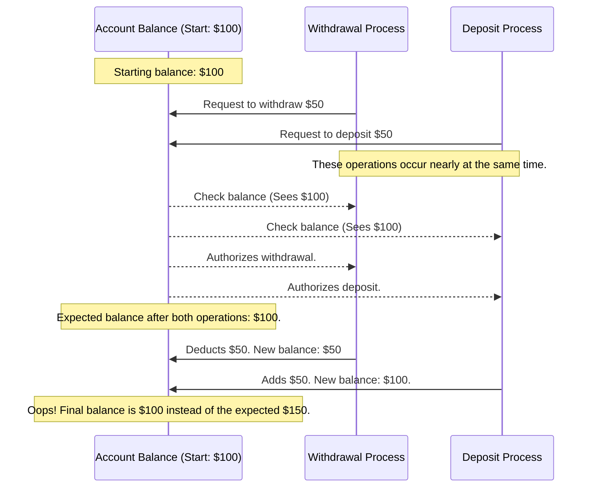

# Implementing a Mutex in Go

I find that the most effective way to understand a programming language is to
build software using it. Similarly, when it comes to understanding programming
concepts, reverse engineering them often offers the deepest insights. This
approach solidifies the fundamentals.

When asked, "How do you learn concurrency in Go?" my default answer is to create
a web application. But Go has made building web applications so straightforward
that I've been curious about diving deeper into Go's concurrency primitives.

So, why not construct a Mutex from scratch? While Go's standard library already
provides one, the process of building it ourselves is an enlightening journey
into the intricacies of concurrency concepts. Note that this won't be an
exhaustive tutorial on Go's concurrency but more of a hands-on exploration.

A mutex, at its core, is a lock that ensures exclusive access to data. By
granting access to only one entity at a time, it prevents synchronization
errors, ensuring data integrity.

Consider the age-old banking dilemma. If two transactions—a withdrawal and a
deposit—occur simultaneously, they can interfere with each other. Here's a flow
chart to illustrate the potential problem:



By introducing a mutex, or a lock, we can control access, ensuring only one
transaction can read or update the account balance at any given time. It's as
simple as that!

For a hands-on approach, we'll use test-driven development. Our test will
simulate the scenario above. For this, we'll leverage goroutines in Go, enabling
us to run code concurrently.

```go
package main_test

import "testing"

func TestRaceCondition(t *testing.T) {
  balance := 100

  // Concurrent withdrawal
  go func() {
    balance = balance - 50
  }()

  // Concurrent deposit
  go func() {
    balance = balance + 50
  }()

  if balance != 100 {
		t.Errorf("Expected balance to be $100, but got $%d", balance)
	}
}
```

Executing `go test main_test.go` might pass successfully on the first try. But
does that mean we're in the clear? Not quite. When you run the code with the
race detector, `go test -race main_test.go`, it will flag a `DATA RACE`.

This warning indicates simultaneous read and write operations on the `balance`
variable. The `-race` flag is an invaluable feature in Go's toolkit, designed to
highlight such concurrent data access issues.
