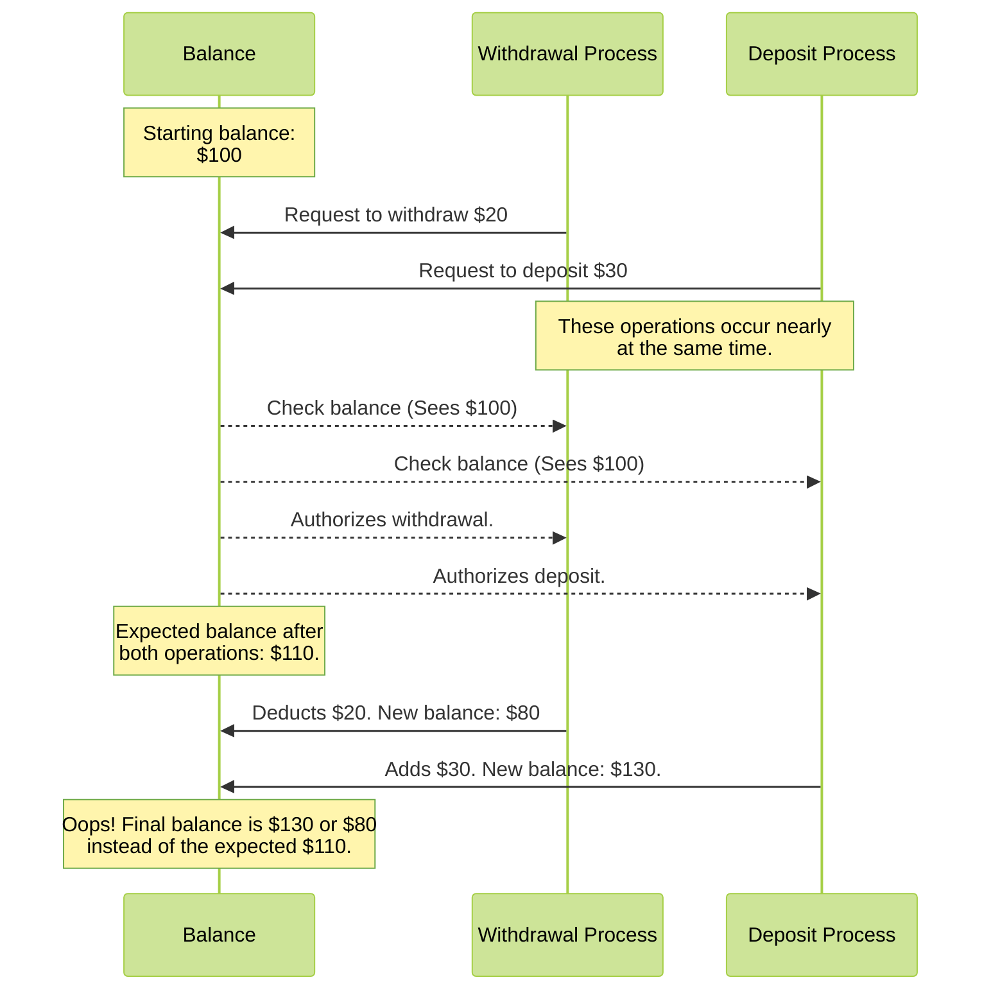

# Implementing a simple Mutex in Go

When asked, "How do you learn concurrency in Go?" my default answer is to create
a web application. But Go has made building web applications so straightforward
that I've been curious about diving deeper into Go's concurrency primitives.

So, why not construct a Mutex from scratch? While Go's standard library already
provides one, it would be helpful to understand why. Note that this won't be an
exhaustive tutorial on Go's concurrency but more of a hands-on exploration.

> Note: This is an introduction to the concept and implementation. It will not
> end up being a production-quality mutex.

A mutex, at its core, is a lock that ensures exclusive access to the execution
of code. This helps prevent synchronization errors, ensures data integrity, and
limits bad actors.

Consider the banking dilemma. If two transactions—a withdrawal and a
deposit—coincide, they can interfere because of the amount of the account
balance. If we start with an account balance of $100, have a withdrawal ($20)
and deposit ($30) occur, we should have $110 at the end of all transactions.

Here's a flow chart to illustrate the potential problem:



By introducing a mutex or a lock, we can control access, ensuring only one
transaction can read or update the account balance at any given time. It's as
simple as that!

For a hands-on approach, we'll use test-driven development. Our test will
simulate the scenario above. For this, we'll leverage goroutines in Go, enabling
us to run code concurrently.

```go
package main_test

import (
  "testing"
  "time"
)

func TestRaceCondition(t *testing.T) {
  balance := 100

  // Concurrent withdrawal
  go func() {
    balance = balance - 20
  }()

  // Concurrent deposit
  go func() {
    balance = balance + 30
  }()

  if balance != 110 {
    t.Errorf("Expected balance to be $100, but got $%d", balance)
  }
}
```

Executing `go test main_test.go` might pass successfully on the first try. But
does that mean we're in the clear? Not quite. When you run the code with the
race detector, `go test -race main_test.go`, it will flag a `DATA RACE`.

```
==================
WARNING: DATA RACE
Write at 0x00c000124158 by goroutine 8:
  command-line-arguments_test.TestRaceCondition.func2()
      /main_test.go:13 +0x3c

Previous read at 0x00c000124158 by goroutine 6:
  command-line-arguments_test.TestRaceCondition()
      /main_test.go:16 +0x110
```

This warning indicates simultaneous read and write operations on the `balance`
variable. The `-race` flag is an invaluable feature in Go's toolkit, designed to
highlight such concurrent data access issues.

We must have each asynchronous operation access `balance` one at a time. The
approach will be to have the process ask for permission, either get or wait for
access, perform the operation, and release access. This will be the logic for
our mutex.

The baseline for our mutex will be if access to the data is requested or not.

To follow the logic above, our code would look like the following:

```go
  accessible := false

	lock := func() {
		for {
			if !accessible {
				accessible = true
				return
			}
		}
	}

	unlock := func() {
		accessible = false
	}
```

We can then add `lock` and `unlock` in the areas we access `balance`.

```go
  go func() {
    lock()
    defer unlock()

    balance = balance - 20
  }()

  go func() {
    lock()
    defer unlock()

    balance = balance + 30
  }()

  lock()
	defer unlock()

	if balance != 110 {
		t.Errorf("Expected balance to be $110, but got $%d", balance)
	}
```

This implementation, however, does not work. It depends on a single value, which
itself causes a race condition. With `lock,` we are reading the value and then
modifying it. With more than one for loop, nothing guarantees that `accessible`
isn't also be accessed at the same time, like `balance.`

The Golang standard library is a way of ensuring a value can only be accessed
once at a time across goroutines. The
[`atomic` package](https://pkg.go.dev/sync/atomic) includes functions to load
and store values in a thread-safe runtime.

> Note: We can use the `atomic` with `balance,` but let's implement a mutex
> first; that's what we are building.

Let's rewrite `lock` and `unlock` to use the `atomic` functions. With the
standard

```go
  var accessible int32

	lock := func() {
		for {
			if atomic.LoadInt32(&accessible) == 0 {
				atomic.StoreInt32(&accessible, 1)
				return
			}
		}
	}

	unlock := func() {
		atomic.StoreInt32(&accessible, 0)
	}
```

When running our tests now, we can see that they pass -- sometimes. A data race
happens every few runs. The trace shows that accessing the `balance` value for
our final assertion is an issue. This information indicates that our mutex is
working by definition. The race condition no longer occurs within the
goroutines.

To fix our assertion so it is thread-safe, we must ensure that the goroutines
have time to run and then use the mutex to access `balance.` Let's do the
cheapest way possible, a `time.Sleep` for the go runtime.

```go
	time.Sleep(time.Millisecond)

	lock()
	defer unlock()

	if balance != 110 {
		t.Errorf("Expected balance to be $110, but got $%d", balance)
	}
```

Running the tests (with the race condition) works correctly and consistently. We
created a mutex! Is it done right?

We can refactor our code. Above, I purposely introduced functionality from
`atomic` for loading and storing so we could implement using our original mutex
logic.

The `atomic` library (since go 1.19) can handle boolean values. The
[`Bool`](https://pkg.go.dev/sync/atomic#Bool) type supports the operation to set
a value only if an expected value exists -- via `CompareAndSwap`.

Our implementation changes to the following:

```go
  accessible := &atomic.Bool{}

	lock := func() {
		for {
			if accessible.CompareAndSwap(false, true) {
				return
			}
		}
	}

	unlock := func() {
		accessible.Store(false)
	}
```

The logic is _simple_ using the functionality from `atomic`. This can eat CPU
cycles while waiting for the unlocking of another segment of code. The go
runtime appears to
[preemptive scheduling](https://github.com/golang/go/issues/10958) to prevent
this tight loop. We want to do our best not to block other goroutines from
running.

When looking at the Go implementation of
[`sync.Mutex`](https://pkg.go.dev/sync#Mutex.Lock), the implementation is
similar for a fast path. There is extensive implementation to prevent CPU
starvation with the `for` loop in a goroutine. There's more we could do to build
out our mutex implementation, but this works for our accounting example. A more
extensive example and implementation is another exercise (maybe a follow-up
post).

However, as a final exercise, we don't need a mutex for the value for `balance.`
As noted above, the `atomic` library allows us to load, store, and swap with an
integer value. We can avoid the usage of a mutex altogether.

```go
	balance := &atomic.Int32{}
	balance.Store(100)

	go balance.Add(-20)
	go balance.Add(30)

	time.Sleep(time.Millisecond)

	if balance.Load() != 110 {
		t.Errorf("Expected balance to be $110, but got $%d", balance)
	}
```

Thanks for following along. Discussion on
[Reddit](https://www.reddit.com/r/golang/comments/17n0djm/implementing_a_simple_mutex/).
