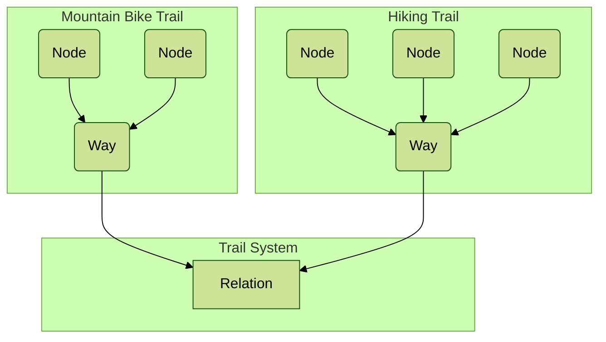

# Optimizing Large-Scale OpenStreetMap Data with SQLite

<div role="alert" class="alert alert-info">
  <svg xmlns="http://www.w3.org/2000/svg" fill="none" viewBox="0 0 24 24" class="stroke-current shrink-0 w-6 h-6"><path stroke-linecap="round" stroke-linejoin="round" stroke-width="2" d="M13 16h-1v-4h-1m1-4h.01M21 12a9 9 0 11-18 0 9 9 0 0118 0z"></path></svg>
  <span><a href="https://news.ycombinator.com/item?id=40864091">Discuss on Hackernews</a></span>
</div>

Over the past year or two, I've worked on a project to convert a massive dataset
into an SQLite database. The original data was in a compressed binary format
known as OSMPBF, which stands for OpenStreetMap Protocol Buffer Format. This
format is highly compact and compressed, making it difficult to search. The goal
of converting it into an SQLite database was to leverage SQLite's search
functionalities, such as full-text search, R-tree indexes, and traditional
B-tree indexes on database table columns.

The [OpenStreetMap (OSM)](https://www.openstreetmap.org) data is categorized
into three main elements: nodes, ways, and relations. A node represents a single
latitude-longitude point, akin to a point along a trail. A way is a series of
nodes forming a path that can be a shape. A relation is an element that can
include other relations, ways, or nodes, such as an entire trail system. Each
component can have metadata associated with it, documented in a well-maintained
[OSM wiki](https://wiki.openstreetmap.org/wiki/Tags).



I'm using the Open Street Map data of the entire
[United States](https://download.geofabrik.de/north-america/us.html) for
project. The stats of the file are around 1.4 billion entries, 9GB in size, and
tags and bounding boxes are deduplicated to save space.

My first task was to transfer this OSM data from its compressed file format into
SQLite. Given the inconsistent tagging across different elements, I used a JSON
data type for tags while keeping other consistent information, such as latitude,
longitude, and element type, in regular columns. This initial SQLite database
was enormous, around 100 gigabytes for the United States, which necessitated
determining which data was essential and how to optimize searches.

```sql
CREATE TABLE entries (
	id       INTEGER PRIMARY KEY AUTOINCREMENT,
	osm_id   INTEGER NOT NULL,
	osm_type INTEGER NOT NULL,
	minLat   REAL,
	maxLat   REAL,
	minLon   REAL,
	maxLon   REAL,
	tags     BLOB, -- key-value pair of tags (JSON)
	refs     BLOB  -- array of nodes, ways, and relations
) STRICT;
```

For instance, a query like "Find all the Costcos" would be practical, but due to
the vast dataset, running a query took over a minute. I realized I needed to
process the data further. By filtering down to elements with specific tags like
name, shop type, and amenity, I reduced the database size to about 40 gigabytes.
Although searches became faster, they were still too slow for practical use,
often taking tens of seconds.

To improve query performance, I explored SQLite's indexing capabilities. While
SQLite doesn't support the same JSON indexing as Postgres, I could create
indexes for individual tags within the JSON.

```sql
CREATE INDEX entries_name ON entries(tags->>'name');
```

However, this requires an index per tag, which won't scale, especially for a
dynamic list of tags. SQLite does offer full-text search for unstructured text,
such as a document. I adapted this by concatenating JSON keys and values into a
single string for full-text indexing, using the following SQL:

```sql
CREATE VIRTUAL TABLE search USING fts5(tags);

WITH tags AS (
	SELECT
		entries.id AS id,
		json_each.key || ' ' || json_each.value AS kv
	FROM
		entries,
		json_each(entries.tags)
)
INSERT INTO
	search(rowid, tags)
SELECT
	id,
	GROUP_CONCAT(kv, ' ')
FROM
	tags
GROUP BY
	id;
```

This approach, combined with using a porter tokenization, allowed me to write
fast queries. For example, searching for "Costco" became incredibly fast, under
a millisecond, though it sometimes returned partial matches like "Costco Mart."

```sql
SELECT rowid FROM search WHERE search MATCH "Costco";
```

Queries with tag-specific values (i.e., `amenity=cafe`) can use text search:

```sql
SELECT rowid FROM search WHERE search MATCH "amenity cafe";
```

This will return results with the words `amenity` and `cafe` appearing in the
full-text index. It does not ensure that the tag equals that specific value. At
the moment, it is best effort, so there are false positives when returning
results.

Despite these improvements, the 40-gigabyte file size needed to be more
manageable. This is a read-only data set, so there may be ways to compress the
data. There are commercial solutions for this, provided by the core maintainers.
SQLite's [virtual file system (VFS)](https://www.sqlite.org/vfs.html) feature
allows an interface for all file operations. This allows different file-like
systems to be used for storage, such as blob stores, other databases, etc.

Initially, I used GZIP compression via Go's built-in functionality, but it
proved too slow due to the need to decompress large portions of the file for
random reads. It appears that the whole file has to be decompressed before
reading parts of it.

Further research led me to Facebook's Zstandard (ZSTD) compression, which
supports a
[seekable format](https://github.com/facebook/zstd/blob/3de0541aef8da51f144ef47fb86dcc38b21afb00/contrib/seekable_format/zstd_seekable_compression_format.md)
suitable for random access reads. This format maps well to SQLite's
[page size](https://www.sqlite.org/pragma.html#pragma_page_size) for writing
data to the file.

I could see that compressing the SQLite file with ZSTD reduced its size to about
13 gigabytes. Benchmarking of compressed and uncompressed SQLite databases. This
is a test database of million entries with a random string of text.

```
BenchmarkReadUncompressedSQLite-4              	  159717	      7459 ns/op	     473 B/op	      15 allocs/op
BenchmarkReadCompressedSQLite-4                	  266703	      3877 ns/op	    2635 B/op	      15 allocs/op
```

_Note:_ The benchmark (via Go) shows that ZSTD is faster than native. My
hypothesis is that this is because the size of the database can be uncompressed
once and held all in memory.

There was a performance hit with the entire database of OpenStreetMap data. I
believe it has to do with how much data there is compared to the test benchmark
above. However, having a compressed database, where a query cost is still sub-50
milliseconds, is helpful.

I've not further optimized the size of the file. I'm pretty happy with this. I
have a _TODO_ for myself to rewrite the ZSTD VFS in C instead of Go.

I want to reduce the number of false positives for the query `amenity=cafe`.
Using the full-text index, it returns results containing the two words, as tags
are not individually indexed.

When using the FTS5 virtual table, it turns out that constraints can be used on
the original data. The index of the full-text search is used first (according to
the query planner), so we can filter that subset down with a more familiar SQL
constraint.

```sql
SELECT
	id
FROM
	entries e
	JOIN search s ON s.rowid = e.id
WHERE
	-- use FTS index to find subset of possible results
	search MATCH 'amenity cafe'
	-- use the subset to find exact matches
	AND tags->>'amenity' = 'cafe';
```

The equals constraint does not use an index, but since it is done on a subset of
results, the operation cost is small. The query is still sub-50ms.

All this provides a read-only SQL queryable data in a single file representing
OpenStreetMap metadata. The project evolved from merely transferring format
migration to optimizing it for efficient search.
