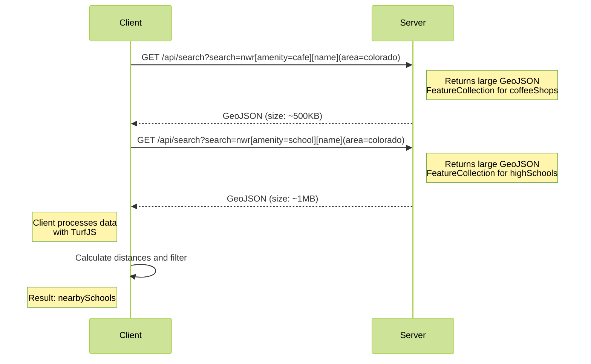

# Efficient API Design: Avoiding Costly External Requests

On a recent project, I built an API that leverages OpenStreetMap data, currently
focusing on the United States and Canada. The API helps users locate
neighborhoods they might want to live in. This journey involved several
iterations of building a web application in read-only mode—a self-imposed
constraint to avoid relying on external services. Everything operates within a
contained environment, such as a container or VM.

This constraint led me to optimize an SQLite database containing OpenStreetMap
data. While I’ve written about
[compressing SQLite data for read-only databases](/posts/2024-07-02-optimizing-large-scale-openstreetmap-data-with-sqlite)
in another blog post, the main challenge was enabling users to query and
correlate geospatial data efficiently.

Initially, my front-end implementation included an endpoint that allowed users
to query OpenStreetMap data in a manner similar to other OpenStreetMap systems.
The queries focused on nodes, ways, or relations and their associated tags.

For example, to find all the Starbucks locations in Colorado, you could use the
following endpoint and query parameter:

- **Endpoint:** `/api/search`
- **Query parameter:** `search=nwr[name=Starbucks](area=colorado)`

The response would return a GeoJSON FeatureCollection, as shown below:

```json
{
  "type": "FeatureCollection",
  "features": [
    {
      "type": "Feature",
      "geometry": {
        "type": "Point",
        "coordinates": [125.6, 10.1]
      },
      "properties": {
        "name": "Starbucks"
      }
    }
  ]
}
```

While this worked, the objective was to allow correlations between entities,
such as identifying schools near coffee shops or places not within a certain
distance of each other. I used TurfJS for these operations in the first
iteration.

```js
import turf from "@turf/turf";
const coffeeShops = await query(`nwr[amenity=cafe][name](area=colorado)`);
const highSchools = await query(`nwr[amenity=school][name](area=colorado)`);

const nearbySchools = [];
coffeeShops.features.forEach((coffeeShop) => {
  highSchools.features.forEach((school) => {
    const distance = turf.distance(coffeeShop, school, { units: "kilometers" });
    if (distance < 1) { // assuming 1 kilometer as the proximity threshold
      nearbySchools.push({
        coffeeShop: coffeeShop.properties.name,
        school: school.properties.name,
        distance: distance,
      });
    }
  });
});
```

The initial approach was functional but slow. For example, querying for schools
in a large state like California could return thousands of results. Transferring
this data from the server to the client and performing geospatial analyses in
the browser with TurfJS was inefficient. Queries often took between 5 and 10
seconds, depending on complexity.

The request-response cycle looked like this:



While this was acceptable for a prototype, I wanted to improve performance. The
idea of moving correlation and geospatial analysis to the server side intrigued
me, inspired by conversations with a former coworker who extended their Go
runtime to support scripting. This led to an exploration of embedding JavaScript
execution on the server using [Goja](https://github.com/dop251/goja).

Goja is a lightweight JavaScript interpreter written in Go.
[Embedding it into my project was straightforward](/posts/2024-08-30-exploring-goja-a-golang-javascript-runtime),
allowing me to expose application infrastructure for server-side JavaScript
execution. This approach let users write JavaScript code to query and correlate
data without sending large datasets over the wire. Instead, the server executed
these queries in a sandboxed environment and returned only the necessary
results.

Initially, I attempted to reuse the same client-side logic, including TurfJS, on
the server. However, TurfJS, being computationally intensive, struggled within
Goja's interpreted environment, leading to query times of 15 to 20 seconds.
Clearly, this was not a viable solution.

To address this, I offloaded the heavy computations to optimized Go functions.
My project already used the Orb library for geospatial operations, so I exposed
Orb's functionality to Goja. This allowed JavaScript code to call underlying Go
functions for tasks like clustering and distance calculations. The result was a
dramatic improvement in performance, reducing query times to sub-second ranges
while minimizing data transfer.

- **Endpoint:** `/api/runtime`
- **Query parameter:** `source=<url encoded JavaScript file>`

```js
const coffeeShops = query.execute(`nwr[amenity=cafe][name](area=colorado)`);
const highSchools = query.execute(`nwr[amenity=school][name](area=colorado)`);

const clusteredShops = coffeeShops.cluster(10); // find coffee shops within 10m of each other

const results = clusteredShops.flatMap((shop) => {
  // find nearby high schools within 1km, returning at most 1 entry
  const nearbyHighSchools = clusteredShops.overlap(highSchools, 1_000, 0, 1);
  return [shop, nearbyHighSchools];
});

const payload = results.asGeoJSON();

export { payload };
```

The system now supports submitting JavaScript code as a parameter to an API
endpoint. This code runs in a sandboxed environment with strict timeouts and
safely interacts with the underlying data. The data remains read-only, and the
platform operates entirely on ephemeral infrastructure hosted by me.

The current platform enables users to test and experiment with running
JavaScript in a sandboxed environment for geospatial queries. It draws parallels
to Overpass QL (OQL) used in OpenStreetMap's Turbo, but I find JavaScript easier
to reason with, especially with TypeScript support. While the API transpiles
TypeScript to JavaScript without type checking, it includes a TypeScript
definition for the sandbox environment. This combination provides a flexible and
user-friendly way to explore geospatial data.

There is more information in the [documentation](https://knowhere.live/docs) for
this project. It should be open to more people soon.
