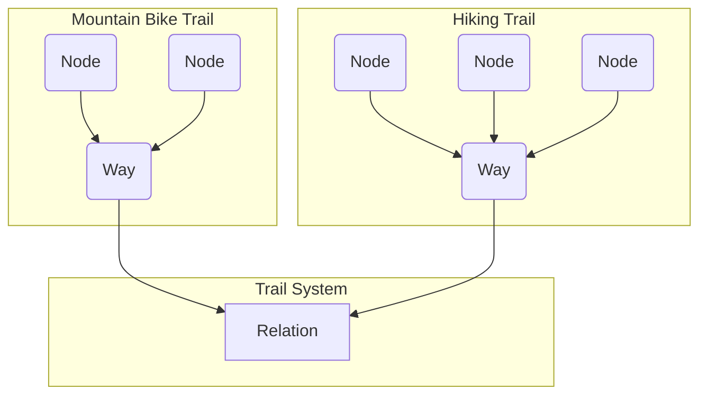

Over the past year or two, I've worked on a project to convert a massive dataset
into an SQLite database. The original data was in a compressed binary format
known as OSMPBF, which stands for OpenStreetMap Protocol Buffer Format. This
format is highly compact and compressed, making it difficult to search. The goal
of converting it into an SQLite database was to leverage SQLite's search
functionalities, such as full-text search, R-tree indexes, and traditional
B-tree indexes on database table columns.

The OpenStreetMap (OSM) data is categorized into three main elements: nodes,
ways, and relations. A node represents a single latitude-longitude point akin to
a point along a trail. A way is a series of nodes forming a path that can be a
shape. A relation is an element that can include other relations, ways, or
nodes, such as an entire trail system. Each component can have metadata
associated with it, documented in a well-maintained
[OSM wiki](https://wiki.openstreetmap.org/wiki/Tags).



My first task was to transfer this OSM data from its compressed file format into
SQLite. Given the inconsistent tagging across different elements, I used a JSON
data type for tags while keeping other consistent information such as latitude,
longitude, and element type in regular columns. This initial SQLite database was
enormous, around 100 gigabytes for the United States, which necessitated
determining which data was essential and how to optimize searches.

```sql
CREATE TABLE entries (
	id       INTEGER PRIMARY KEY AUTOINCREMENT,
	osm_id   INTEGER NOT NULL,
	osm_type INTEGER NOT NULL,
	minLat   REAL,
	maxLat   REAL,
	minLon   REAL,
	maxLon   REAL,
	tags     BLOB, -- key-value pair of tags (JSON)
	refs     BLOB  -- array of node, ways, and relations
) STRICT;
```

For instance, a query like "Find all the Costcos" would be practical, but due to
the vast dataset, running a query took over a minute. I realized I needed to
process the data further. By filtering down to elements with specific tags like
name, shop type, and amenity, I reduced the database size to about 40 gigabytes.
Although searches became faster, they were too slow for practical use, often
taking 10s of seconds.

To improve query performance, I explored SQLite's indexing capabilities. While
SQLite doesn't support the same JSON indexing as Postgres, it does offer
full-text search for unstructured text. I adapted this by concatenating JSON
keys and values into a single string for full-text indexing.

```sql
CREATE VIRTUAL TABLE
			search
		USING
			fts5(tags);

WITH tags AS (
			SELECT
				entries.id AS id,
				json_each.key || ' ' || json_each.value AS kv
			FROM
				entries,
				json_each(entries.tags)
		)
		INSERT INTO
			search(rowid, tags)
		SELECT
			id,
			GROUP_CONCAT(kv, ' ')
		FROM
			tags
		GROUP BY
			id;
```

This approach, combined with using a trigram search, allowed me to write fast
queries. For example, searching for "Costco" became incredibly fast, under a
millisecond, though it sometimes returned partial matches like "Costco Mart."

```sql
SELECT rowid FROM search WHERE search MATCH "Costco";
```

Despite these improvements, the 40-gigabyte file size needed to be more
manageable. This a read only data set, so there may be ways to compress the
data. There are commercial solutions for this, but I wanted a cost-effective
method. SQLite's virtual file system (VFS) feature allows for customization,
including reading from compressed files. Initially, I used GZIP compression via
Go's built-in functionality, but it proved too slow due to the need to
decompress large portions of the file for random reads.

Further research led me to Facebook's Zstandard (ZSTD) compression, which
supports a
[seekable format](https://github.com/facebook/zstd/blob/3de0541aef8da51f144ef47fb86dcc38b21afb00/contrib/seekable_format/zstd_seekable_compression_format.md)
suitable for random access "like" reads. This format maps well to SQLite's block
and page data storage. Compressing my SQLite file with ZSTD reduced its size to
about 13 gigabytes.

The following represents the benchmark of compressed and uncompressed sqlite
database. This is a test database of million entries with a random string of
text.

```
BenchmarkReadUncompressedSQLite-4              	  159717	      7459 ns/op	     473 B/op	      15 allocs/op
BenchmarkReadCompressedSQLite-4                	  266703	      3877 ns/op	    2635 B/op	      15 allocs/op
```

There was a performance hit with the entire database of Open Street Map data. I
believe has to do with how much data there is compared to the test benchmark
above. However, a smaller database with a query cost still being sub 20
millisecond is great.

I'd like to spend time on

In conclusion, the project evolved from merely transferring data to optimizing
it for efficient search. This highlights the importance of iterative refinement
and the power of combining different technologies to solve complex problems.
